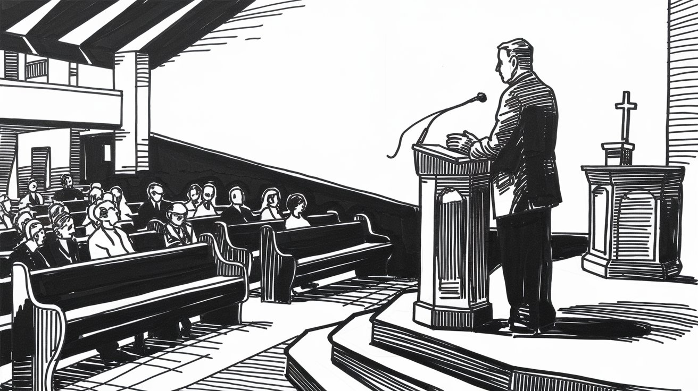

In the tapestry of community, where every thread has its role, the work of a pastor weaves through the very heart of it, binding us together in moments of joy, sorrow, and reflection. It's a role that transcends the boundaries of mere duty, touching the essence of empathy, guidance, and unwavering support.

Pastors stand by us, guide us through life's tumultuous storms, and illuminate paths we might never have found alone. They dedicate their lives not to the pursuit of personal glory, but to serving others, often placing the needs of their community before their own.

The act of expressing gratitude through poetry becomes not just an act of recognition, but a celebration of our shared humanity. Poetry, with its nuanced language and profound ability to capture the depths of human emotion, serves as an ideal medium to convey our appreciation for those who guide us spiritually.

It allows us to articulate the often indescribable impact a pastor can have on our lives, offering back a piece of the beauty they have helped to cultivate in our souls.

Thank you poems for pastors are a small but significant gesture. It acknowledges the immense contributions they make, often behind the scenes, and affirming that their efforts have not gone unnoticed.

It's about creating a moment of connection, a heartfelt acknowledgment that their dedication and love have touched our lives in ways that mere words can seldom fully capture. Yet, we try, through poetry, to offer a reflection of the light they have bestowed upon us.

Use these thank you poems for pastors as a way to strengthen the fabric of your community, reminding others of the power of gratitude and the importance of recognizing a pastor's contributions.

## 10 Thank You Poems for Pastors
------------------------------

### Light Upon the Path
-------------------

This poem serves as a heartfelt thank you to pastors who dedicate their lives to not only understanding the depth of Scripture but making it accessible and relevant to our everyday lives. Through their guidance, we find clarity in confusion, light in darkness, and hope in despair. Their teachings go beyond the walls of the church, touching hearts and transforming lives.

> In quiet reverence, your words unfold,  
> A tapestry of truths, ancient and bold.  
> With gentle wisdom and a patient heart,  
> You guide our steps, right from the start.
> 
> Each scripture, a beacon; your teaching, a key,  
> Unlocking the mysteries for us to see.  
> Through stories of old, you bridge time and space,  
> Bringing lessons to life, to our own place.
> 
> In moments of doubt, your faith stands firm,  
> A lighthouse guiding us through every storm.  
> Your interpretations, a map to explore,  
> Revealing paths to doors we'd not opened before.
> 
> You weave the divine into our daily stride,  
> Showing us how in His love we abide.  
> With each verse shared, a seed is sown,  
> In the fertile grounds of hearts once stone.
> 
> Your dedication, a mirror of His grace,  
> Reflecting the light of His embrace.  
> In gratitude, words often fall short,  
> For the spiritual journey you’ve helped us escort.
> 
> May this poem, a humble offering be,  
> A token of our thanks, for helping us see.  
> Not just the words, but the actions they inspire,  
> To live a life of love, to which we aspire.

### Shepherd of the Heartland
-------------------------

As a witness to the nurturing of community bonds and outreach to those in need, this poem aims to encapsulate the profound impact of a pastor's engagement. It serves as a heartfelt acknowledgment of their dedication to fostering unity and compassion, both within the congregation and beyond.

> In fields where hearts are sown with care,  
> You tend to souls, your love we share.  
> With steadfast hand and spirit bright,  
> You guide us through both day and night.
> 
> Your words, a beacon in the dark,  
> Illuminate the path we embark.  
> In fellowship, we find our light,  
> Embracing hope, dispelling fright.
> 
> Through deeds of kindness, pure and true,  
> You teach us what it means to do.  
> To feed the hungry, clothe the cold,  
> To offer solace to the old.
> 
> In every act, your love shines through,  
> A testament to all you do.  
> For in your hands, we find our peace,  
> Your grace and love will never cease.

### Harbor of Hope
--------------

This poem is a humble offering of thanks, a testament to the profound impact our pastor has had in nurturing the delicate dynamics of our families. Through his guidance, we've learned the importance of patience, understanding, and unconditional love in creating a harmonious home.

> In the quiet moments, between dawn and dusk's embrace,  
> Where whispers of the heart, in sacred spaces trace,  
> You've stood, a steadfast guardian, of love's tender grace,  
> Guiding us through storms, to a peaceful place.
> 
> With tender care, you've sown, in us, seeds of trust,  
> Nurtured with wisdom, compassion, a touch so just.  
> In marriage vows renewed, in love’s gentle embrace,  
> You’ve taught us unity through trials we face.
> 
> Parenting's winding path, with joys and fears entwined,  
> Found solace in your counsel, so gentle and kind.  
> In your words, a lighthouse, by which we're guided, refined,  
> A beacon of hope, in life's storms, we find.
> 
> And in the dusk of years, as caregivers we stand,  
> Your wisdom a compass, in this uncharted land.  
> With patience and love, you extend a helping hand,  
> Teaching us to love, to listen, to understand.
> 
> For all the hearts you've healed, the families you've mended,  
> Your tender care, your love, unpretended,  
> This thank you, though simple, deeply intended,  
> For the peace, the unity, you've so splendidly tended.
> 
> May this poem be a mirror, reflecting the light you've given,  
> A token of our gratitude, for a life so compassionately driven.  
> In your honor, we stand together, uplifted and renewed,  
> For by your love, our family’s story is beautifully imbued.

### Healing Hands: A Poem of Gratitude
----------------------------------

In times of trial and tribulation, our pastors are the steadfast pillars of support, guiding us with wisdom and compassion.

> In the quiet sanctuary of your presence,  
> Where words are whispered like sacred hymns,  
> Your hands, like gentle breezes,  
> Sweep away shadows, banishing fears and whims.
> 
> With each prayer uttered,  
> You weave hope into our souls’ fabric bright,  
> Stitching fragments of our brokenness,  
> With threads of faith and guiding light.
> 
> Your prayers, a calm for spirits worn and torn,  
> Your words, a melody of peace and grace,  
> As we journey through valleys forlorn,  
> Your light guides us to a safe, warm place.
> 
> So here, in this humble verse,  
> I offer thanks from my heart’s core,  
> For your unwavering love and grace,  
> For being God’s healing touch, and so much more.

### Gratitude in Verse: Nurturing Souls Through Mental Health
---------------------------------------------------------

As a retired teacher and lifelong poet, I understand the profound impact words can have, especially when expressing gratitude. This poem is a heartfelt tribute to the pastors who tirelessly offer guidance and resources for mental health and emotional well-being.

> In the quiet whispers of solace,  
> Amidst the tumult of troubled minds,  
> You stand as a beacon of hope,  
> Offering solace that often we struggle to find.
> 
> Through prayers and compassionate ears,  
> You tend to wounds unseen,  
> With gentle words and steadfast presence,  
> You nurture hearts back to serene.
> 
> In the sanctuary of your understanding,  
> We find refuge from life's stormy seas,  
> Your wisdom a lighthouse in the darkness,  
> Guiding us to shores of inner peace.
> 
> So here's a humble thank you,  
> For the light you shine so bright,  
> For being our compass through the fog,  
> And guiding us toward the light.
> 
> Though mere words may not suffice,  
> Know that in our hearts you'll stay,  
> Our pastors, our pillars of strength,  
> Thank you for lighting our way.

### Lightbearers in Distant Lands
-----------------------------

This poem is a homage to those who carry their faith beyond familiar shores, illuminating paths less traveled with love and service. Their mission work, often unseen, nurtures seeds of hope and community in the farthest corners of our world.

> In lands afar, beneath foreign stars, you tread,  
> Bearing light where faint hearts often dread.  
> With each step, in every word and deed,  
> You plant hope's seed, tending to every need.
> 
> Your journey, marked by selfless love's embrace,  
> Transforms each space into a state of grace.  
> Hands that heal, words that soothe the weary soul,  
> In every role, you make broken spirits whole.
> 
> Through trials, your faith stands firm, ever bright,  
> Guiding light in the darkest night.  
> Your work, a testament to love's boundless scope,  
> Ignites hope, in realms bereft of hope.
> 
> For every smile you've drawn, for tears you've dried,  
> For the wide world made better by your stride—  
> Thank you, bearers of light, for all you've done,  
> Under the sun, and by the moon and stars above,  
> Your mission of love, a beacon to us all.

### Everlasting Beacon of Hope
--------------------------

A brief reflection on the enduring presence of hope and encouragement offered by pastors in our lives.

> In times of darkness, you shine bright,  
> A beacon of hope in the deepest night.  
> Your words, a balm to soothe the soul,  
> Guiding us towards a hopeful goal.
> 
> Through valleys low and mountains high,  
> You walk beside us, never shy.  
> Your encouragement, a steadfast guide,  
> Fills our hearts with courage, far and wide.
> 
> So, here's a thank you, deep and true,  
> For all you are and all you do.  
> Your constant hope, a guiding light,  
> Illuminating even the darkest night.

### A Shepherd's Echo: A Call to Preach
-----------------------------------

This simple token of appreciation aims to mirror the depth of commitment and love our pastors pour into their calling, acknowledging their unwavering dedication to their flock and their ceaseless efforts to spread hope and faith.

> In the hush of dawn, amidst the silent plea,  
> A call was heard, as clear as it could be.  
> Not in the thunder, nor in the raging storm,  
> But in a gentle breeze, a sacred form.
> 
> He stood, a man among the seeking crowd,  
> With nothing but His faith, steadfast and unbowed.  
> To preach, to guide, to love, and to care,  
> A mission divine, beyond compare.
> 
> Through valleys deep and mountains steep,  
> His voice carried, awakening those asleep.  
> In every word, a seed of hope was sown,  
> In every gesture, His love was shown.
> 
> "Thank you," we say, not just in passing remark,  
> But with a gratitude that lights the dark.  
> For answering the call, for being the guide,  
> On this spiritual journey, our trusted side.
> 
> Your path was chosen, your purpose clear,  
> A shepherd to the flock you hold so dear.  
> In every challenge, every heartfelt plea,  
> You answered His call, for all to see.
> 
> So here's to you, our pastor, our friend,  
> Our gratitude, so vast, knows no end.  
> For every lesson, every prayer, every call,  
> Thank you, dear pastor, for giving your all.

### You Practice What You Preach
----------------------------

Expressing appreciation through poetry is a profound way to illuminate the significance of our pastors' influence in our lives.

> In shepherd's grace, the pastor stands,  
> A servant true with open hands.  
> He walks the path the Lord has shown,  
> In every word, his deeds are sown.
> 
> With faith as firm as granite stone,  
> He guides the flock, not seeking praise.  
> In trials and in darkened days,  
> His life reflects the Savior's ways.
> 
> He preaches love, and love he gives,  
> In humble acts, the Gospel lives.  
> His daily walk, a shining light,  
> That mirrors Christ's own path of right.
> 
> Through mercy’s touch and prayers that rise,  
> He shares the truth with faithful eyes.  
> In every sermon, heart, and soul,  
> He lives the words that make us whole.
> 
> So praise the shepherd who fulfills,  
> The call to serve with steadfast will.  
> In every action, word, and deed,  
> He shows the love that Christ decreed.

### Embracing Souls: A Tribute to Guidance
--------------------------------------

This poem reflects my deep appreciation for the way our pastor has opened the doors of the church and his heart, welcoming everyone with open arms, and embodying the true spirit of inclusivity and love.

> In the house of faith, under a spire that pierces the sky,  
> Our pastor stands, a beacon of light, with arms open wide.
> 
> "Come," he says, with a warmth that ignites the soul,  
> "Here, you'll find refuge, a place to be whole."
> 
> With every soul that crosses the threshold,  
> He sees not just faces, but stories untold.
> 
> In his eyes, there's no stranger, only friends yet known,  
> A shepherd of spirits, in kindness, he's grown.
> 
> Through tempests and calm, his guidance, a constant star,  
> Teaching us love, for near and for far.
> 
> In gratitude, we stand, a congregation true,  
> For in his embrace, we've found a love so new.
> 
> Thank you, dear pastor, for every welcome, every grace,  
> In this sacred space, we've all found our place.

You may also enjoy these [pastor appreciation poems](https://poemsabouteverything.com/pastor-appreciation-poems.html).